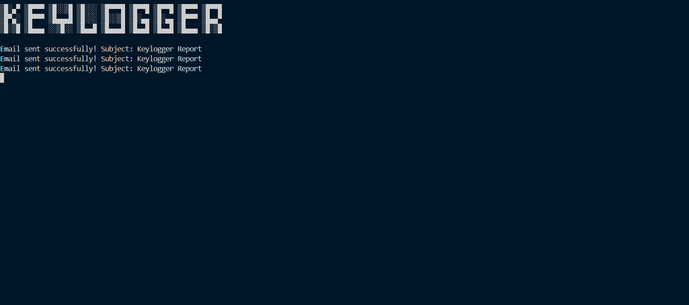
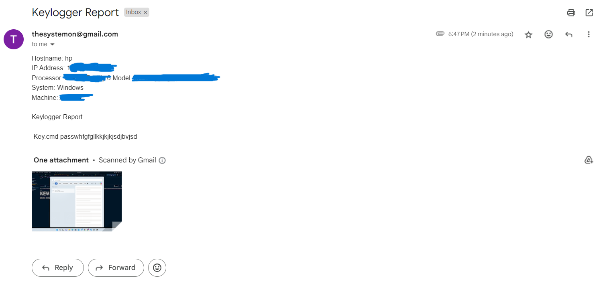
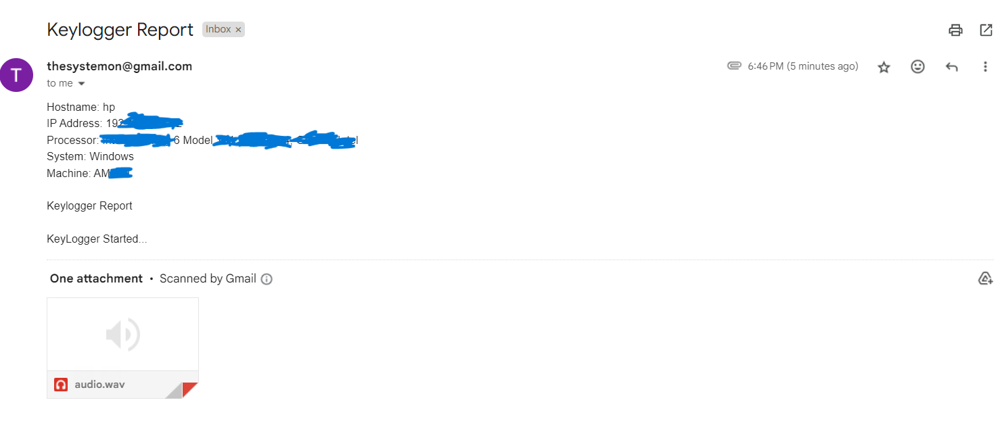

# Keylogger Project

This project implements a keylogger in Python, designed for educational purposes. 

## Overview

The keylogger logs keystrokes, captures system information, takes screenshots, and records audio at regular intervals. It sends collected data via email periodically using SMTP.

## Disclaimer

This project is purely educational and meant for learning about cybersecurity concepts, ethical hacking, and defensive security measures. **Do not use this software for malicious purposes or without proper authorization.** Use it responsibly and only on systems you own or have explicit permission to monitor.

## Features

- Logs keystrokes including special keys like SPACE and ESC.
- Captures system information (hostname, IP address, processor, etc.).
- Takes screenshots and records audio periodically.
- Sends collected data securely via email.






## Requirements

- Python 3.x
- Dependencies: `pyscreenshot`, `sounddevice`, `pynput`

## Installation

1. Clone the repository:
   ```bash
   git clone https://github.com/kunalnamdas/keylogger.git
   cd keylogger
   ```

2 . Install dependencies
   ```
   pip install -r requirements.txt
   ```

# Usage
- Configure your Gmail credentials in the script (EMAIL_ADDRESS and EMAIL_PASSWORD).

- Run the keylogger:

- python keylogger.py

- Press Ctrl+C to stop the keylogger.

## License

This project is licensed under the MIT License - see the LICENSE file for details.

# Disclaimer

### This software is for educational purposes only. The author is not responsible for any misuse or damage caused by this program.


## Contributing

Contributions are welcome! Feel free to open issues or pull requests.

## Acknowledgments

- Pynput library for keyboard monitoring.
  
- Pyscreenshot library for taking screenshots.
  
- Sounddevice library for audio recording.

 ```bash
### Notes:
- Replace `your_username` with your actual GitHub username in the clone URL.
- Customize the sections as per your project's specific features and requirements.
- Ensure to provide clear instructions on installation, usage, and configuration (especially concerning Gmail credentials).
- Mention the ethical use disclaimer prominently to ensure responsible usage.

This `README.md` template should effectively convey the purpose and usage of your educational keylogger project on GitHub. Adjust it further based on any additional features or specific details of your implementation.
  ```


